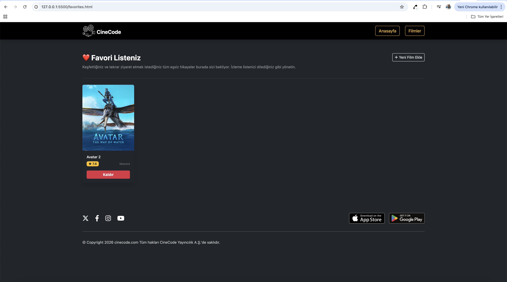

# CineCode - Film İzleme Uygulaması
CineCode, modern web teknolojileri kullanılarak geliştirilmiş, kullanıcıların anlık olarak film araması yapabildiği ve detaylı film bilgilerine ulaşabildiği dinamik bir web uygulamasıdır.

## Özellikler
Dinamik Film Arama: Kullanıcıların gerçek zamanlı film sorgulaması yapabilmesini sağlar.
Film Detay Sayfası: Filmlerin özetleri, puanları ve çıkış tarihleri gibi detaylı bilgileri görüntüler.
Responsive Tasarım: Tüm cihazlarla (mobil, tablet, masaüstü) tam uyumlu kullanıcı arayüzü.
Scrollbar Özelleştirmesi: Uzun film özetleri için kutu içerisinde özel kaydırma çubuğu tasarımı.

## Canlı Önizleme
[Canlı demoyu görmek için buraya tıklayın](https://github.com/mustafaugur1991-cmyk/Film_izleme_uygulamasi.git)

## Kullanılan Teknolojiler
HTML5, CSS3, JavaScript (ES6+)
Framework/Library: React
Bootstrap 4.5 & CSS Grid/Flexbox 
VS Code, Git, GitHub

## Kurulum ve Çalıştırma
Projeyi yerel makinenizde çalıştırmak için şu adımları izleyin:

Projeyi klonlayın: git clone https://github.com/mustafaugur1991/Film_izleme_uygulamasi.git

Proje dizinine gidin: cd Film_izleme_uygulamasi

Gerekli paketleri yükleyin: npm install

Uygulamayı başlatın: npm start

## Ekran Görüntüsü

